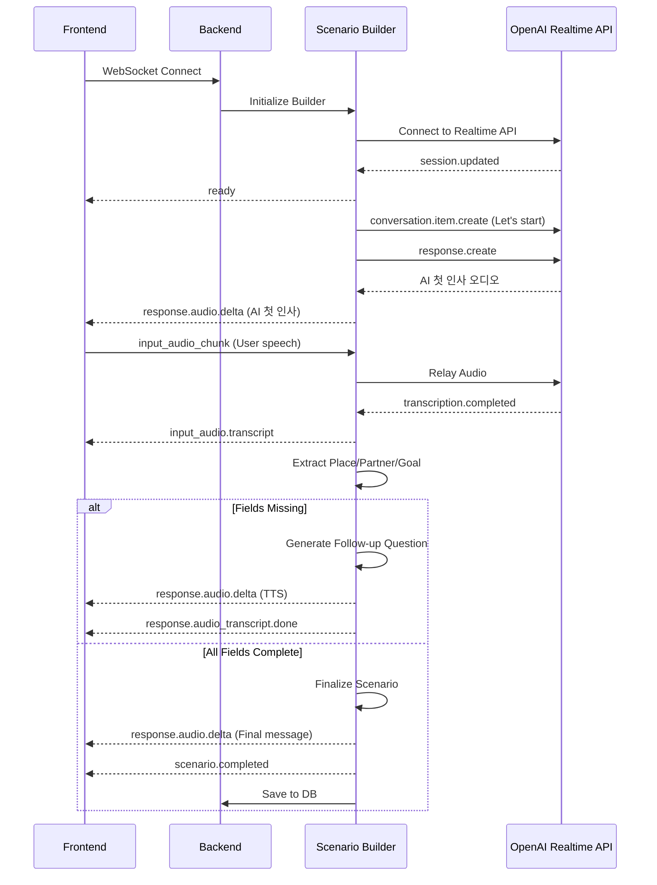
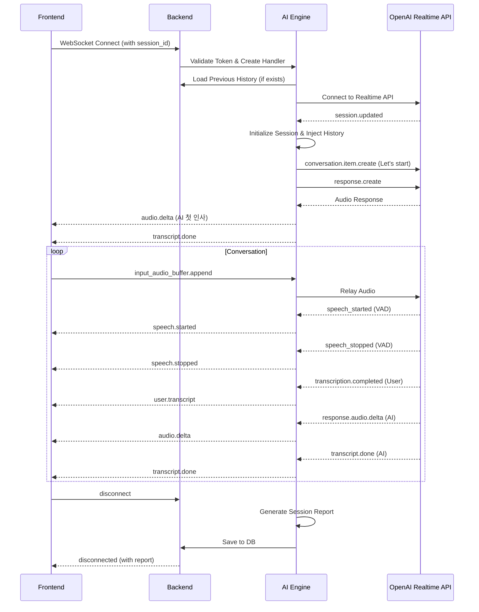

# WebSocket 사용 가이드

프론트엔드 개발자를 위한 MaLangEE WebSocket 이벤트 상세 가이드

---

## ⚠️ 중요: 두 WebSocket은 서로 다른 이벤트를 사용합니다

MaLangEE는 **두 가지 독립적인 WebSocket 기능**을 제공하며, 각각 **다른 이벤트 타입**을 사용합니다:

| 기능 | WebSocket 타입 | 이벤트 네이밍 |
|------|---------------|--------------|
| **주제 정하기** | Scenario WebSocket | `input_audio_chunk`, `response.audio.delta` 등 |
| **대화하기** | Chat WebSocket | `input_audio_buffer.append`, `audio.delta` 등 |

**절대 혼용하지 마세요!** 각 WebSocket은 자신만의 이벤트 타입을 사용합니다.

---

## 목차

1. [개요](#1-개요)
2. [주제 정하기 - Scenario WebSocket](#2-주제-정하기---scenario-websocket)
3. [대화하기 - Chat WebSocket](#3-대화하기---chat-websocket)
4. [오디오 포맷 및 처리](#4-오디오-포맷-및-처리)
5. [에러 처리](#5-에러-처리)
6. [구현 예시](#6-구현-예시)

---

## 1. 개요

### 1.1 주제 정하기 (Scenario WebSocket)

**엔드포인트:**
```
회원: /api/v1/scenario/ws/scenario?token={access_token}
게스트: /api/v1/scenario/ws/guest-scenario
```

**백엔드 구현**: `backend/app/api/v1/scenario.py:108, 123`

**용도:**
- 대화 주제(시나리오) 자동 생성
- 사용자 음성/텍스트에서 Place, Partner, Goal 추출
- AI가 후속 질문을 통해 정보 수집
- 시나리오 완성 후 `sessionId` 반환 및 DB 자동 저장
- 연결 시 AI가 자동으로 첫 인사 시작

**주요 이벤트:**
- 클라이언트 → 서버: `input_audio_chunk`, `text`
- 서버 → 클라이언트: `response.audio.delta`, `scenario.completed`

**AI Engine 구현**: `ai-engine/scenario/realtime_bridge.py:52`

---

### 1.2 대화하기 (Chat WebSocket)

**엔드포인트:**
```
회원: /api/v1/chat/ws/chat/{session_id}?token={access_token}&voice=alloy&show_text=true
게스트: /api/v1/chat/ws/guest-chat/{session_id}?voice=alloy&show_text=true
```

**백엔드 구현**: `backend/app/api/v1/chat.py:108, 124`

**용도:**
- 실시간 영어 회화 연습
- OpenAI GPT-4o와 실시간 음성 대화
- 사용자 발화 자동 분석 (WPM, 발화 시간)
- 대화 종료 시 세션 리포트 및 피드백 생성 (10개 이상 메시지)
- 이전 대화 히스토리 자동 복원 (같은 session_id 사용 시)
- 연결 시 AI가 자동으로 첫 인사 시작

**주요 이벤트:**
- 클라이언트 → 서버: `input_audio_buffer.append`
- 서버 → 클라이언트: `audio.delta`, `user.transcript`

**AI Engine 구현**: `ai-engine/realtime_conversation/connection_handler.py:16`

**Query Parameters:**
- `voice` (선택): AI 음성 (`alloy`, `echo`, `fable`, `onyx`, `nova`, `shimmer`)
- `show_text` (선택): 자막 표시 여부 (`true`/`false`)

---

## 2. 주제 정하기 - Scenario WebSocket

### 2.1 연결 흐름



---

### 2.2 이벤트 목록

#### 2.2.1 클라이언트 → 서버 이벤트

##### (1) `input_audio_chunk` - 오디오 전송

사용자 음성을 서버로 전송합니다.

**전송:**
```json
{
  "type": "input_audio_chunk",
  "audio": "AAAAAQIDBA...",
  "sample_rate": 24000
}
```

**필드:**
- `audio`: Base64 인코딩된 PCM16 오디오 데이터
- `sample_rate`: 샘플링 레이트 (기본: 24000)

**발생 시점:**
- 마이크 녹음 중 실시간으로 전송 (100ms 간격 권장)

---

##### (2) `input_audio_commit` - 오디오 커밋

현재까지 전송된 오디오를 하나의 발화로 확정합니다.

**전송:**
```json
{
  "type": "input_audio_commit"
}
```

**발생 시점:**
- 사용자가 말하기를 멈췄을 때 (VAD 미사용 모드)
- 현재 Scenario WebSocket은 **Server VAD 모드**를 사용하므로 일반적으로 **전송 불필요**

---

##### (3) `input_audio_clear` - 오디오 버퍼 클리어

입력 오디오 버퍼를 비웁니다.

**전송:**
```json
{
  "type": "input_audio_clear"
}
```

**발생 시점:**
- 사용자가 녹음을 취소하거나 재시작할 때

---

##### (4) `text` - 텍스트 입력

음성 대신 텍스트로 시나리오 정보를 입력합니다.

**전송:**
```json
{
  "type": "text",
  "text": "I am at a hotel talking to the receptionist to check in."
}
```

**발생 시점:**
- 사용자가 음성 대신 텍스트로 시나리오 입력
- 빠른 테스트 또는 접근성 기능 사용 시

---

#### 2.2.2 서버 → 클라이언트 이벤트

##### (1) `ready` - 연결 준비 완료

WebSocket 연결이 준비되었습니다.

**수신:**
```json
{
  "type": "ready"
}
```

**발생 시점:**
- OpenAI Realtime API 연결 완료 및 세션 초기화 후 (연결 후 약 1-2초)

**처리 방법:**
- UI 업데이트 (예: "연결 중..." → "주제를 말씀해주세요")
- 오디오 녹음 시작 허용

**중요 사항:**
- `ready` 이벤트 직후, 서버가 자동으로 "Let's start" 메시지를 OpenAI에 전송하여 AI의 첫 인사를 트리거합니다 (`ai-engine/scenario/realtime_bridge.py:235-255`)
- 따라서 클라이언트는 `ready` 수신 직후 `response.audio.delta` 이벤트를 통해 AI의 첫 인사 오디오를 수신하게 됩니다

---

##### (2) `input_audio.transcript` - 사용자 발화 텍스트

사용자가 말한 내용의 전사 결과입니다.

**수신:**
```json
{
  "type": "input_audio.transcript",
  "transcript": "I'm at a hotel talking to the receptionist to check in."
}
```

**필드:**
- `transcript`: Whisper 전사 결과

**발생 시점:**
- 사용자 발화 종료 후 (Server VAD 감지 또는 커밋 후)

**처리 방법:**
- 자막 UI에 표시
- 사용자 입력 내용 확인용

---

##### (3) `response.audio.delta` - AI 응답 오디오

AI의 음성 응답 청크입니다.

**수신:**
```json
{
  "type": "response.audio.delta",
  "delta": "AAAAAQIDBA...",
  "sample_rate": 24000
}
```

**필드:**
- `delta`: Base64 인코딩된 PCM16 오디오 청크
- `sample_rate`: 샘플링 레이트 (보통 24000)

**발생 빈도:**
- AI 응답 중 연속적으로 수신 (약 100ms 간격)

**처리 방법:**
1. Base64 디코딩
2. AudioContext를 사용하여 재생
3. 버퍼링하여 끊김 없이 재생

---

##### (4) `response.audio.done` - AI 응답 오디오 완료

AI 음성 응답이 끝났음을 알립니다.

**수신:**
```json
{
  "type": "response.audio.done"
}
```

**발생 시점:**
- AI가 한 턴의 응답을 완료했을 때

**처리 방법:**
- 오디오 재생 완료 처리
- UI 상태 업데이트

---

##### (5) `response.audio_transcript.done` - AI 응답 텍스트

AI가 말한 내용의 텍스트입니다.

**수신:**
```json
{
  "type": "response.audio_transcript.done",
  "transcript": "Great! Could you tell me more about your conversation partner?"
}
```

**필드:**
- `transcript`: AI 발화 내용

**발생 시점:**
- `response.audio.done` 직후

**처리 방법:**
- 자막 UI에 표시
- 후속 질문 확인

---

##### (6) `scenario.completed` - 시나리오 완성

시나리오 빌딩이 완료되었습니다.

**수신:**
```json
{
  "type": "scenario.completed",
  "json": {
    "place": "hotel",
    "conversation_partner": "receptionist",
    "conversation_goal": "check in",
    "sessionId": "550e8400-e29b-41d4-a716-446655440000"
  },
  "completed": true
}
```

**필드:**
- `place`: 대화 장소
- `conversation_partner`: 대화 상대
- `conversation_goal`: 대화 목적
- `sessionId`: 저장된 세션 ID (대화하기에서 사용)

**발생 시점:**
- Place, Partner, Goal이 모두 추출되었을 때
- 또는 최대 시도 횟수 초과 시 (폴백)

**서버 동작:**
- 시나리오 완료 시 서버가 자동으로 DB에 저장 (`ai-engine/scenario/realtime_bridge.py:124-173`)
- LLM을 통해 대화 내용 기반 세션 제목 자동 생성
- `backend/app/repositories/chat_repository.py`를 통해 PostgreSQL에 저장

**처리 방법:**
1. 시나리오 정보 저장 (클라이언트 로컬 또는 상태 관리)
2. **중요:** `sessionId`를 저장 (다음 단계에서 사용)
3. "대화하기" 화면으로 이동
4. Chat WebSocket 연결 시 이 `sessionId` 사용

---

##### (7) `error` - 에러 발생

에러가 발생했습니다.

**수신:**
```json
{
  "type": "error",
  "message": "Realtime connection timeout"
}
```

**처리 방법:**
- 에러 메시지 표시
- 재시도 또는 종료

---

### 2.3 이벤트 발생 순서 예시

```
[주제 정하기 시작]
1. Frontend → Backend: WebSocket 연결
2. Backend: OpenAI 연결, "Let's start" 메시지 자동 전송
3. Backend → Frontend: ready
4. Backend → Frontend: response.audio.delta (AI 첫 인사 TTS)
5. Backend → Frontend: response.audio.done
6. Backend → Frontend: response.audio_transcript.done ("안녕하세요! 어떤 상황에서...")

[첫 번째 발화]
7. Frontend → Backend: input_audio_chunk (계속 전송)
8. Backend → Frontend: input_audio.transcript ("I'm at a hotel")
   → 서버: Place 추출 ("hotel"), Partner/Goal 누락 감지
9. Backend → Frontend: response.audio.delta (TTS 질문 오디오)
10. Backend → Frontend: response.audio.done
11. Backend → Frontend: response.audio_transcript.done ("Great! Who are you talking to?")

[두 번째 발화]
12. Frontend → Backend: input_audio_chunk
13. Backend → Frontend: input_audio.transcript ("the receptionist")
   → 서버: Partner 추출 ("receptionist"), Goal 누락 감지
14. Backend → Frontend: response.audio.delta
15. Backend → Frontend: response.audio.done
16. Backend → Frontend: response.audio_transcript.done ("What do you want to achieve?")

[세 번째 발화]
17. Frontend → Backend: input_audio_chunk
18. Backend → Frontend: input_audio.transcript ("check in")
   → 서버: Goal 추출 ("check in"), 모든 필드 완성!
19. Backend → Frontend: response.audio.delta (완료 메시지)
20. Backend → Frontend: response.audio.done
21. Backend → Frontend: response.audio_transcript.done ("Perfect! Let's start...")
22. Backend → Frontend: scenario.completed (시나리오 정보 + sessionId)
23. 서버: DB에 시나리오 저장 (자동)
24. WebSocket 연결 종료
```

---

## 3. 대화하기 - Chat WebSocket

### 3.1 연결 흐름



---

### 3.2 이벤트 목록

#### 3.2.1 클라이언트 → 서버 이벤트

##### (1) `input_audio_buffer.append` - 오디오 전송

사용자 마이크 입력을 서버로 전송합니다.

**전송:**
```json
{
  "type": "input_audio_buffer.append",
  "audio": "AAAAAQIDBA..."
}
```

**필드:**
- `audio`: Base64 인코딩된 PCM16 오디오 데이터

**발생 시점:**
- 마이크 녹음 중 실시간으로 전송 (100ms 간격 권장)

**주의사항:**
- AudioWorklet 또는 MediaRecorder를 사용하여 PCM16 포맷으로 변환 필요
- 샘플링 레이트: 24000 Hz
- 채널: 모노 (1채널)
- 비트 깊이: 16-bit

---

##### (2) `input_audio_buffer.commit` - 오디오 커밋

현재까지 전송된 오디오를 하나의 발화로 확정합니다.

**전송:**
```json
{
  "type": "input_audio_buffer.commit"
}
```

**발생 시점:**
- 사용자가 말하기를 멈췄을 때 (VAD 미사용 모드)
- 현재 Chat WebSocket은 **Server VAD 모드**를 사용하므로 일반적으로 **전송 불필요**

**Server VAD 모드:**
- 서버가 자동으로 발화 시작/종료를 감지
- `speech.started`, `speech.stopped` 이벤트 자동 수신

---

##### (3) `response.create` - 응답 요청

AI의 응답을 강제로 요청합니다.

**전송:**
```json
{
  "type": "response.create"
}
```

**발생 시점:**
- 사용자가 응답을 기다리는 상황 (일반적으로 자동 처리되므로 드물게 사용)

---

##### (4) `session.update` - 세션 설정 변경

AI 음성이나 기타 설정을 실시간으로 변경합니다.

**전송:**
```json
{
  "type": "session.update",
  "config": {
    "voice": "nova"
  }
}
```

**가능한 설정:**
- `voice`: `alloy`, `echo`, `fable`, `onyx`, `nova`, `shimmer`

**발생 시점:**
- 사용자가 UI에서 음성 설정을 변경했을 때

**주의사항:**
- 음성 변경 시 서버가 OpenAI 세션을 재연결하므로 1-2초 지연 발생 가능

---

##### (5) `disconnect` - 연결 종료 요청

대화를 종료하고 세션을 저장합니다.

**전송:**
```json
{
  "type": "disconnect"
}
```

**발생 시점:**
- 사용자가 대화 종료 버튼 클릭
- 페이지 이탈 전

---

#### 3.2.2 서버 → 클라이언트 이벤트

##### (1) `audio.delta` - AI 응답 오디오

AI가 말하는 음성 데이터를 실시간으로 수신합니다.

**수신:**
```json
{
  "type": "audio.delta",
  "delta": "AAAAAQIDBA..."
}
```

**필드:**
- `delta`: Base64 인코딩된 PCM16 오디오 청크

**발생 빈도:**
- AI 응답 중 연속적으로 수신 (약 100ms 간격)

**처리 방법:**
1. Base64 디코딩
2. AudioContext를 사용하여 재생
3. 버퍼링하여 끊김 없이 재생

---

##### (2) `audio.done` - AI 응답 오디오 완료

AI 음성 응답이 끝났음을 알립니다.

**수신:**
```json
{
  "type": "audio.done"
}
```

**발생 시점:**
- AI가 한 턴의 응답을 완료했을 때

**처리 방법:**
- 오디오 재생 완료 처리
- UI 상태 업데이트 (예: "AI 말하는 중..." → "듣는 중...")

---

##### (3) `transcript.done` - AI 응답 텍스트

AI가 말한 내용의 텍스트 자막입니다.

**수신:**
```json
{
  "type": "transcript.done",
  "transcript": "Hello! How can I help you today?"
}
```

**필드:**
- `transcript`: AI 발화 내용 (영어)

**발생 시점:**
- `audio.done` 직후

**처리 방법:**
- 자막 UI에 표시
- 대화 히스토리에 추가 (`role: "assistant"`)

---

##### (4) `user.transcript` - 사용자 발화 텍스트

사용자가 말한 내용의 텍스트 자막입니다.

**수신:**
```json
{
  "type": "user.transcript",
  "transcript": "I would like to check in."
}
```

**필드:**
- `transcript`: 사용자 발화 내용 (Whisper 전사 결과)

**발생 시점:**
- 사용자 발화 종료 후 (VAD 감지 또는 커밋 후)

**처리 방법:**
- 자막 UI에 표시
- 대화 히스토리에 추가 (`role: "user"`)

---

##### (5) `speech.started` - 사용자 발화 시작

서버 VAD가 사용자의 발화 시작을 감지했습니다.

**수신:**
```json
{
  "type": "speech.started"
}
```

**발생 시점:**
- 사용자가 말하기 시작했을 때 (Server VAD 자동 감지)

**처리 방법:**
- UI 업데이트 (예: 마이크 아이콘 활성화, 애니메이션)
- AI 응답 중이었다면 재생 중단 (Interruption)

---

##### (6) `speech.stopped` - 사용자 발화 종료

서버 VAD가 사용자의 발화 종료를 감지했습니다.

**수신:**
```json
{
  "type": "speech.stopped"
}
```

**발생 시점:**
- 사용자가 말하기를 멈췄을 때 (Server VAD 자동 감지)

**처리 방법:**
- UI 업데이트 (예: 마이크 아이콘 비활성화)
- 자동으로 AI 응답 대기 상태로 전환

---

##### (7) `disconnected` - 세션 종료 및 리포트

WebSocket 연결이 종료되고 세션 분석 리포트를 수신합니다.

**수신:**
```json
{
  "type": "disconnected",
  "reason": "Session ended",
  "report": {
    "session_id": "550e8400-e29b-41d4-a716-446655440000",
    "title": "Hotel Check-in Conversation",
    "started_at": "2024-01-15T10:00:00",
    "ended_at": "2024-01-15T10:15:00",
    "total_duration_sec": 900.5,
    "user_speech_duration_sec": 450.2,
    "messages": [
      {
        "role": "user",
        "content": "Hello, I'd like to check in.",
        "timestamp": "2024-01-15T10:00:10",
        "duration_sec": 2.5
      },
      {
        "role": "assistant",
        "content": "Welcome! May I have your name?",
        "timestamp": "2024-01-15T10:00:15",
        "duration_sec": 3.2
      }
    ],
    "feedback": "당신의 발음은 명확하고 자연스러웠습니다...",
    "scenario_summary": "호텔 체크인 상황에서 성공적으로 대화를 완료했습니다..."
  }
}
```

**필드:**
- `reason`: 종료 사유
- `report`: 세션 분석 결과
  - `session_id`: 세션 고유 ID
  - `total_duration_sec`: 전체 대화 시간 (초)
  - `user_speech_duration_sec`: 사용자 발화 시간 (초)
  - `messages`: 전체 대화 내역
  - `feedback`: AI 피드백 (메시지 10개 초과 시 생성, 한국어)
  - `scenario_summary`: 대화 시나리오 요약 (메시지 10개 초과 시 생성, 한국어)

**발생 시점:**
- WebSocket 연결 종료 시 (정상 종료 또는 에러)
- 서버가 자동으로 세션 리포트를 생성하고 DB에 저장 (`ai-engine/realtime_conversation/connection_handler.py:299-347`)

**피드백 생성 조건:**
- 전체 메시지 수(히스토리 포함) > 10개: 피드백 및 요약 생성 (`conversation_feedback/feedback_service.py`)
- 메시지 수 ≤ 10개: "대화가 충분하지 않아 분석을 진행할수 없어요."

**처리 방법:**
1. 세션 결과 화면으로 이동
2. 리포트 데이터를 로컬 저장 또는 분석 화면 표시
3. `feedback` 및 `scenario_summary` 표시 (존재하는 경우)
4. 필요시 `/api/v1/chat/sessions/{session_id}/sync` 호출하여 계정 연동 (게스트인 경우)

---

##### (8) `error` - 에러 발생

서버에서 에러가 발생했습니다.

**수신:**
```json
{
  "type": "error",
  "code": "openai_disconnected",
  "message": "OpenAI connection lost: Network error"
}
```

**에러 코드:**
- `server_error`: 서버 내부 오류
- `openai_disconnected`: OpenAI 연결 끊김

**처리 방법:**
- 사용자에게 에러 메시지 표시
- 재연결 시도 또는 세션 종료

---

### 3.3 이벤트 발생 순서 예시

```
[대화 시작]
1. Frontend → Backend: WebSocket 연결 (session_id 포함)
2. Backend: 토큰 검증, 이전 세션 히스토리 조회 (있는 경우)
3. Backend: OpenAI 연결, 히스토리 주입, "Let's start" 메시지 자동 전송
4. Backend → Frontend: audio.delta (AI 첫 인사 "Hello! How can I help you today?")
5. Backend → Frontend: audio.done
6. Backend → Frontend: transcript.done ("Hello! How can I help you today?")

[첫 번째 대화 턴]
7. Frontend → Backend: input_audio_buffer.append (계속 전송)
8. Backend → Frontend: speech.started (VAD 감지)
9. Frontend → Backend: input_audio_buffer.append (계속)
10. Backend → Frontend: speech.stopped (VAD 감지)
11. Backend → Frontend: user.transcript ("I would like to check in.")

12. Backend → Frontend: audio.delta (AI 응답)
13. Backend → Frontend: audio.done
14. Backend → Frontend: transcript.done ("Sure, may I have your name?")

[대화 계속...]
... (7-14 반복)

[대화 종료]
15. Frontend → Backend: disconnect
16. Backend: 세션 리포트 생성 (메시지 10개 초과 시 피드백 생성) 및 DB 저장
17. Backend → Frontend: disconnected (세션 리포트 + 피드백 포함)
18. WebSocket 연결 종료
```

---

## 4. 오디오 포맷 및 처리

### 4.1 오디오 사양

**입력 (클라이언트 → 서버):**
- 포맷: PCM16 (16-bit Linear PCM)
- 샘플링 레이트: 24000 Hz
- 채널: 모노 (1채널)
- 인코딩: Base64

**출력 (서버 → 클라이언트):**
- 포맷: PCM16
- 샘플링 레이트: 24000 Hz
- 채널: 모노
- 인코딩: Base64

**두 WebSocket 모두 동일한 오디오 포맷 사용**

---

### 4.2 브라우저에서 오디오 캡처 (AudioWorklet 사용)

#### Step 1: AudioWorklet Processor 등록

**audio-processor.js:**
```javascript
class AudioProcessor extends AudioWorkletProcessor {
  process(inputs, outputs, parameters) {
    const input = inputs[0];
    if (!input || !input[0]) return true;

    const samples = input[0]; // Float32Array
    const pcm16 = this.float32ToPCM16(samples);

    this.port.postMessage({
      audio: this.arrayBufferToBase64(pcm16)
    });

    return true;
  }

  float32ToPCM16(float32Array) {
    const pcm16 = new Int16Array(float32Array.length);
    for (let i = 0; i < float32Array.length; i++) {
      const s = Math.max(-1, Math.min(1, float32Array[i]));
      pcm16[i] = s < 0 ? s * 0x8000 : s * 0x7FFF;
    }
    return pcm16.buffer;
  }

  arrayBufferToBase64(buffer) {
    const bytes = new Uint8Array(buffer);
    let binary = '';
    for (let i = 0; i < bytes.byteLength; i++) {
      binary += String.fromCharCode(bytes[i]);
    }
    return btoa(binary);
  }
}

registerProcessor('audio-processor', AudioProcessor);
```

#### Step 2: 주제 정하기에서 사용

```javascript
async function startAudioCaptureForScenario(websocket) {
  const stream = await navigator.mediaDevices.getUserMedia({
    audio: {
      sampleRate: 24000,
      channelCount: 1,
      echoCancellation: true,
      noiseSuppression: true
    }
  });

  const audioContext = new AudioContext({ sampleRate: 24000 });
  const source = audioContext.createMediaStreamSource(stream);

  await audioContext.audioWorklet.addModule('audio-processor.js');
  const workletNode = new AudioWorkletNode(audioContext, 'audio-processor');

  workletNode.port.onmessage = (event) => {
    // Scenario WebSocket 이벤트 사용
    websocket.send(JSON.stringify({
      type: 'input_audio_chunk',  // 주의: Scenario는 input_audio_chunk
      audio: event.data.audio,
      sample_rate: 24000
    }));
  };

  source.connect(workletNode);
  workletNode.connect(audioContext.destination);
}
```

#### Step 3: 대화하기에서 사용

```javascript
async function startAudioCaptureForChat(websocket) {
  const stream = await navigator.mediaDevices.getUserMedia({
    audio: {
      sampleRate: 24000,
      channelCount: 1,
      echoCancellation: true,
      noiseSuppression: true
    }
  });

  const audioContext = new AudioContext({ sampleRate: 24000 });
  const source = audioContext.createMediaStreamSource(stream);

  await audioContext.audioWorklet.addModule('audio-processor.js');
  const workletNode = new AudioWorkletNode(audioContext, 'audio-processor');

  workletNode.port.onmessage = (event) => {
    // Chat WebSocket 이벤트 사용
    websocket.send(JSON.stringify({
      type: 'input_audio_buffer.append',  // 주의: Chat은 input_audio_buffer.append
      audio: event.data.audio
    }));
  };

  source.connect(workletNode);
  workletNode.connect(audioContext.destination);
}
```

---

### 4.3 브라우저에서 오디오 재생

**두 WebSocket 모두 동일한 재생 로직 사용 가능 (Base64 PCM16 → AudioBuffer)**

```javascript
class AudioPlayer {
  constructor() {
    this.audioContext = new AudioContext({ sampleRate: 24000 });
    this.queue = [];
    this.isPlaying = false;
  }

  addChunk(base64Audio) {
    const pcm16 = this.base64ToArrayBuffer(base64Audio);
    const int16Array = new Int16Array(pcm16);
    const float32Array = new Float32Array(int16Array.length);

    for (let i = 0; i < int16Array.length; i++) {
      float32Array[i] = int16Array[i] / 32768.0;
    }

    const audioBuffer = this.audioContext.createBuffer(1, float32Array.length, 24000);
    audioBuffer.getChannelData(0).set(float32Array);

    this.queue.push(audioBuffer);
    if (!this.isPlaying) {
      this.playNext();
    }
  }

  playNext() {
    if (this.queue.length === 0) {
      this.isPlaying = false;
      return;
    }

    this.isPlaying = true;
    const audioBuffer = this.queue.shift();
    const source = this.audioContext.createBufferSource();
    source.buffer = audioBuffer;
    source.connect(this.audioContext.destination);

    source.onended = () => {
      this.playNext();
    };

    source.start();
  }

  base64ToArrayBuffer(base64) {
    const binaryString = atob(base64);
    const bytes = new Uint8Array(binaryString.length);
    for (let i = 0; i < binaryString.length; i++) {
      bytes[i] = binaryString.charCodeAt(i);
    }
    return bytes.buffer;
  }
}

// 사용 예시 (Scenario)
const scenarioPlayer = new AudioPlayer();
scenarioWs.onmessage = (event) => {
  const data = JSON.parse(event.data);
  if (data.type === 'response.audio.delta') {  // Scenario 이벤트
    scenarioPlayer.addChunk(data.delta);
  }
};

// 사용 예시 (Chat)
const chatPlayer = new AudioPlayer();
chatWs.onmessage = (event) => {
  const data = JSON.parse(event.data);
  if (data.type === 'audio.delta') {  // Chat 이벤트
    chatPlayer.addChunk(data.delta);
  }
};
```

---

## 5. 에러 처리

### 5.1 WebSocket 에러

```javascript
websocket.onerror = (error) => {
  console.error('WebSocket error:', error);
  // 에러 UI 표시
};

websocket.onclose = (event) => {
  console.log('WebSocket closed:', event.code, event.reason);

  if (event.code === 4003) {
    alert('인증되지 않은 세션 접근입니다.');
  } else if (event.code === 4004) {
    alert('세션을 찾을 수 없습니다.');
  } else if (event.code === 1008) {
    alert('서버 설정 오류가 발생했습니다.');
  } else if (event.code === 1011) {
    alert('서버 구성 오류가 발생했습니다.');
  }
};
```

### 5.2 서버 에러 이벤트

**두 WebSocket 모두 동일한 `error` 타입 사용**

```javascript
websocket.onmessage = (event) => {
  const data = JSON.parse(event.data);

  if (data.type === 'error') {
    console.error('Server error:', data.code || data.message);

    // Scenario WebSocket (code 없음, message만 있음)
    if (data.message) {
      alert(`에러: ${data.message}`);
    }

    // Chat WebSocket (code와 message 모두 있음)
    if (data.code === 'openai_disconnected') {
      alert('AI 연결이 끊어졌습니다. 재시도합니다.');
      // 재연결 로직
    }
  }
};
```

---

## 6. 구현 예시

### 6.1 주제 정하기 (Scenario) 전체 예시 (React)

```typescript
import { useEffect, useRef, useState } from 'react';

interface ScenarioResult {
  place: string;
  partner: string;
  goal: string;
  sessionId: string;
}

export function useScenarioWebSocket(token: string) {
  const wsRef = useRef<WebSocket | null>(null);
  const audioPlayerRef = useRef<AudioPlayer | null>(null);
  const [isReady, setIsReady] = useState(false);
  const [userTranscript, setUserTranscript] = useState('');
  const [aiResponse, setAiResponse] = useState('');
  const [result, setResult] = useState<ScenarioResult | null>(null);

  useEffect(() => {
    const ws = new WebSocket(
      `ws://localhost:8080/api/v1/scenario/ws/scenario?token=${token}`
    );

    audioPlayerRef.current = new AudioPlayer();

    ws.onopen = () => {
      console.log('Scenario WebSocket connected');
    };

    ws.onmessage = (event) => {
      const data = JSON.parse(event.data);

      switch (data.type) {
        case 'ready':
          setIsReady(true);
          startAudioCaptureForScenario(ws);
          break;

        case 'input_audio.transcript':
          setUserTranscript(data.transcript);
          break;

        case 'response.audio.delta':  // Scenario 이벤트
          audioPlayerRef.current?.addChunk(data.delta);
          break;

        case 'response.audio.done':
          // 오디오 재생 완료
          break;

        case 'response.audio_transcript.done':
          setAiResponse(data.transcript);
          break;

        case 'scenario.completed':
          setResult({
            place: data.json.place,
            partner: data.json.conversation_partner,
            goal: data.json.conversation_goal,
            sessionId: data.json.sessionId
          });
          break;

        case 'error':
          console.error('Error:', data.message);
          alert(`에러 발생: ${data.message}`);
          break;
      }
    };

    ws.onerror = (error) => {
      console.error('WebSocket error:', error);
    };

    ws.onclose = (event) => {
      console.log('Scenario WebSocket closed');
    };

    wsRef.current = ws;

    return () => {
      ws.close();
    };
  }, [token]);

  return {
    isReady,
    userTranscript,
    aiResponse,
    result
  };
}
```

---

### 6.2 대화하기 (Chat) 전체 예시 (React)

```typescript
import { useEffect, useRef, useState } from 'react';

interface ChatMessage {
  role: 'user' | 'assistant';
  content: string;
  timestamp: string;
}

export function useChatWebSocket(sessionId: string, token: string) {
  const wsRef = useRef<WebSocket | null>(null);
  const audioPlayerRef = useRef<AudioPlayer | null>(null);
  const [messages, setMessages] = useState<ChatMessage[]>([]);
  const [isConnected, setIsConnected] = useState(false);
  const [isSpeaking, setIsSpeaking] = useState(false);

  useEffect(() => {
    const ws = new WebSocket(
      `ws://localhost:8080/api/v1/chat/ws/chat/${sessionId}?token=${token}&voice=alloy&show_text=true`
    );

    audioPlayerRef.current = new AudioPlayer();

    ws.onopen = () => {
      console.log('Chat WebSocket connected');
      setIsConnected(true);
      startAudioCaptureForChat(ws);
    };

    ws.onmessage = (event) => {
      const data = JSON.parse(event.data);

      switch (data.type) {
        case 'audio.delta':  // Chat 이벤트
          audioPlayerRef.current?.addChunk(data.delta);
          break;

        case 'audio.done':
          setIsSpeaking(false);
          break;

        case 'transcript.done':
          setMessages((prev) => [
            ...prev,
            {
              role: 'assistant',
              content: data.transcript,
              timestamp: new Date().toISOString()
            }
          ]);
          break;

        case 'user.transcript':
          setMessages((prev) => [
            ...prev,
            {
              role: 'user',
              content: data.transcript,
              timestamp: new Date().toISOString()
            }
          ]);
          break;

        case 'speech.started':
          setIsSpeaking(true);
          break;

        case 'speech.stopped':
          setIsSpeaking(false);
          break;

        case 'disconnected':
          console.log('Session report:', data.report);
          // 결과 화면으로 이동
          break;

        case 'error':
          console.error('Error:', data.code, data.message);
          alert(`에러 발생: ${data.message}`);
          break;
      }
    };

    ws.onerror = (error) => {
      console.error('WebSocket error:', error);
    };

    ws.onclose = (event) => {
      console.log('WebSocket closed:', event.code, event.reason);
      setIsConnected(false);
    };

    wsRef.current = ws;

    return () => {
      ws.close();
    };
  }, [sessionId, token]);

  const disconnect = () => {
    wsRef.current?.send(JSON.stringify({ type: 'disconnect' }));
  };

  const changeVoice = (voice: string) => {
    wsRef.current?.send(JSON.stringify({
      type: 'session.update',
      config: { voice }
    }));
  };

  return {
    messages,
    isConnected,
    isSpeaking,
    disconnect,
    changeVoice
  };
}
```

---

## 7. 이벤트 비교표

### 7.1 오디오 전송 이벤트 비교

| 기능 | 주제 정하기 (Scenario) | 대화하기 (Chat) |
|------|----------------------|----------------|
| **오디오 전송** | `input_audio_chunk` | `input_audio_buffer.append` |
| **오디오 커밋** | `input_audio_commit` | `input_audio_buffer.commit` |
| **오디오 클리어** | `input_audio_clear` | (없음) |
| **텍스트 입력** | `text` | (없음) |

### 7.2 오디오 수신 이벤트 비교

| 기능 | 주제 정하기 (Scenario) | 대화하기 (Chat) |
|------|----------------------|----------------|
| **AI 오디오** | `response.audio.delta` | `audio.delta` |
| **오디오 완료** | `response.audio.done` | `audio.done` |
| **AI 텍스트** | `response.audio_transcript.done` | `transcript.done` |
| **사용자 텍스트** | `input_audio.transcript` | `user.transcript` |

### 7.3 상태 이벤트 비교

| 기능 | 주제 정하기 (Scenario) | 대화하기 (Chat) |
|------|----------------------|----------------|
| **연결 준비** | `ready` | (없음, 바로 AI 인사) |
| **발화 시작** | (없음) | `speech.started` |
| **발화 종료** | (없음) | `speech.stopped` |
| **완료** | `scenario.completed` | `disconnected` |
| **에러** | `error` (message만) | `error` (code + message) |

---

## 8. 개발 팁

1. **이벤트 타입 주의**: 두 WebSocket의 이벤트 타입을 절대 혼용하지 마세요!
   - Scenario: `input_audio_chunk`, `response.audio.delta`
   - Chat: `input_audio_buffer.append`, `audio.delta`

2. **오디오 권한 요청**: 사용자에게 마이크 권한을 명시적으로 요청하세요.

3. **에러 핸들링**: 네트워크 불안정 시 재연결 로직을 구현하세요.

4. **메모리 관리**: 오디오 버퍼가 무한정 쌓이지 않도록 주의하세요.

5. **지연 최소화**: 오디오 청크를 즉시 재생하여 대화 흐름을 자연스럽게 유지하세요.

6. **UI 피드백**: 연결 상태, 발화 상태 등을 명확히 표시하세요.

7. **Session ID 관리**:
   - Scenario WebSocket 완료 후 받은 `sessionId`를 저장
   - Chat WebSocket 연결 시 이 `sessionId` 사용
   - 같은 `sessionId`로 재연결 시 이전 대화 히스토리가 자동 복원됩니다

8. **자동 첫 인사**:
   - 두 WebSocket 모두 연결 시 서버가 "Let's start" 메시지를 자동으로 전송하여 AI의 첫 인사를 트리거합니다
   - 클라이언트는 별도의 초기화 메시지를 보낼 필요가 없습니다

9. **피드백 생성**:
   - Chat WebSocket 종료 시 메시지가 10개를 초과하면 AI 피드백이 자동 생성됩니다
   - 피드백은 한국어로 제공되며 발음, 유창성, 문법 등을 분석합니다

10. **세션 자동 저장**:
    - Scenario 완료 시 자동으로 DB에 저장됩니다 (클라이언트 요청 불필요)
    - Chat 종료 시 세션 리포트와 함께 DB에 저장됩니다

---

## 참고 문서 및 파일 경로

### 백엔드 API 엔드포인트
- **Chat WebSocket**: `backend/app/api/v1/chat.py:90` (회원용), `:112` (게스트용)
- **Scenario WebSocket**: `backend/app/api/v1/scenario.py:45` (회원용), `:61` (게스트용)
- **Chat Service**: `backend/app/services/chat_service.py:95` (AI 세션 시작)
- **Chat Repository**: `backend/app/repositories/chat_repository.py` (DB 저장)

### AI Engine 구현
- **주제 정하기 (Scenario)**:
  - 메인 핸들러: `ai-engine/scenario/realtime_bridge.py:52` (`handle_client`)
  - 파이프라인: `ai-engine/scenario/realtime_pipeline.py` (이벤트 기반 오케스트레이션)
  - 시나리오 빌더: `ai-engine/scenario/scenario_builder.py` (상태 관리 및 질문 생성)
  - LLM 클라이언트: `ai-engine/scenario/llm_client.py` (추출/후속 질문/완성)

- **대화하기 (Chat)**:
  - 연결 핸들러: `ai-engine/realtime_conversation/connection_handler.py:16` (`ConnectionHandler`)
  - 대화 관리자: `ai-engine/realtime_conversation/conversation_manager.py` (세션 설정/프롬프트 관리)
  - 대화 추적기: `ai-engine/realtime_conversation/conversation_tracker.py` (WPM/분석)
  - 세션 관리자: `ai-engine/realtime_conversation/session_manager.py` (메모리 내 세션 추적)

- **피드백 생성**:
  - 피드백 서비스: `ai-engine/conversation_feedback/feedback_service.py` (LangGraph 기반 에이전트)

### 데이터베이스 모델
- **세션 모델**: `backend/app/db/models.py` (`ConversationSession`, `Message`)
- **스키마**: `backend/app/schemas/chat.py` (Pydantic 모델)
