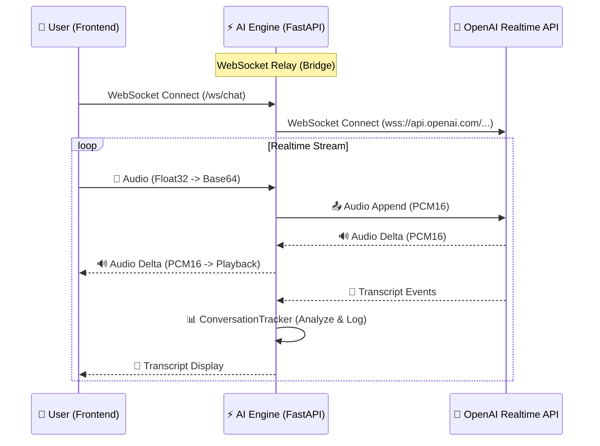

# Realtime Conversation Module

## 📌 개요 (Overview)
이 모듈은 **MaLangEE AI Engine**의 핵심 컴포넌트로, **OpenAI Realtime API(GPT-4o)**와 클라이언트(Frontend) 간의 **실시간 양방향 음성 대화**를 중계하고 관리합니다.

MSA(Microservices Architecture) 지향적인 설계를 따르며, 대화의 **상태 관리(State)**, **분석(Analytics)**, **제어(Control)**를 담당하여 백엔드 로직과 분리된 독립적인 AI 전담 처리반 역할을 수행합니다.

## 🏗️ 아키텍처 (Architecture)

## 🧩 주요 컴포넌트 (Components)

### 1. `ConnectionHandler` (`connection_handler.py`)
- **역할**: 클라이언트와 OpenAI 사이의 **중계자(Relay)**.
- **기능**:
    - 두 개의 WebSocket(Client↔Server, Server↔OpenAI)을 관리.
    - 오디오 스트림 및 이벤트를 실시간으로 토스(Pass-through).
    - 에러 핸들링 및 세션 초기화/종료 처리.
    - **세션 컨텍스트 주입**: 초기 연결 시 `ConversationManager`를 통해 세션 컨텍스트(제목, 장소, 파트너, 목표)를 프롬프트에 주입.
    - **보이스 설정**: 클라이언트 요청에 따라 보이스 설정을 적용하고 필요 시 재연결.

### 2. `ConversationManager` (`conversation_manager.py`)
- **역할**: 대화의 **설정(Config) 및 두뇌(Memory)** 관리.
- **기능**:
    - **3-Layer Prompt Assembly**:
        1. **Base**: 템플릿 치환 후의 기본 페르소나 (세션 컨텍스트 반영).
        2. **Active User**: 사용자 요청에 따른 추가 설정 (예: "한국어로 해줘").
        3. **Dynamic**: WPM 분석 등에 따른 동적 가이드.
    - **세션 컨텍스트 주입**: `inject_session_context`를 통해 프롬프트 템플릿 변수(`{{SESSION_TITLE}}`, `{{KEY_INFO_1}}` 등) 치환.
    - **동적 가이드**: 사용자의 상태(속도 등)에 따라 프롬프트를 실시간으로 변경(`update_speaking_style`).
    - **히스토리 주입**: 이전 대화 내용을 OpenAI 세션에 주입하여 문맥 유지.

### 3. `ConversationTracker` (`conversation_tracker.py`)
- **역할**: 대화의 **분석가(Analyst)**.
- **기능**:
    - **메트릭 측정**: 대화 총 시간, 사용자 발화 시간(VAD 기반), 턴 수 측정.
    - **WPM 분석**: 사용자의 말하기 속도를 계산하여 **Super Slow / Slow / Normal / Fast** 상태 판별.
    - **리포트 생성**: 세션 종료 시 구조화된 JSON 데이터(`Session` + `Messages`) 반환.

### 4. `SessionManager` (`session_manager.py`)
- **역할**: 인메모리 세션 관리자 (Singleton).
- **기능**:
    - 활성 세션(`ConnectionHandler`) 등록 및 조회.
    - 현재 활성 세션 수 모니터링.

### 5. `Test Server` (`test_server.py`)
- **역할**: 로컬 테스트 및 디버깅용 FastAPI 서버.
- **기능**:
    - **Debug Mode**: `DebugConversationManager`와 `DebugConnectionHandler`를 사용하여 내부 상태(WPM 등)를 클라이언트로 전송.
    - **Persistence Simulation**: 인메모리 `HISTORY_CACHE`를 사용하여 세션 간 대화 내용 유지 테스트.

## 🔄 데이터 흐름 및 확장성 (Scalability)
- **비동기 처리**: `asyncio` 기반으로 설계되어 단일 프로세스에서도 다수의 동시 접속 처리가 가능합니다.
- **인터페이스 기반 저장**: 추후 `ISessionRepository` 인터페이스를 통해 로컬 DB(SQLite)뿐만 아니라 외부 API 또는 메인 백엔드 DB로 데이터를 유연하게 전송할 수 있습니다.
